# WY NineXore AI

A dark-canvas developer console for the [9Router](https://github.com/decolua/9router) AI gateway, plus a small local CUDA service that adds **Bahasa Indonesia TTS (Coqui, 83 voices)**, **on-device 31-language TTS (Supertonic)**, and **offline Whisper transcription**.

One window covers every 9Router capability — chat, image generation, text-to-speech, speech-to-text, embeddings, web search, URL fetching — and an image-to-text (Vision / OCR) panel that extracts text from images via multimodal chat.

Built in Python (FastAPI) + vanilla ES-module JS. No build tool.


---

## Screenshots

Every panel renders on a dark canvas with a single lavender accent. Click any thumbnail to open the full-resolution capture.

<p align="center">
  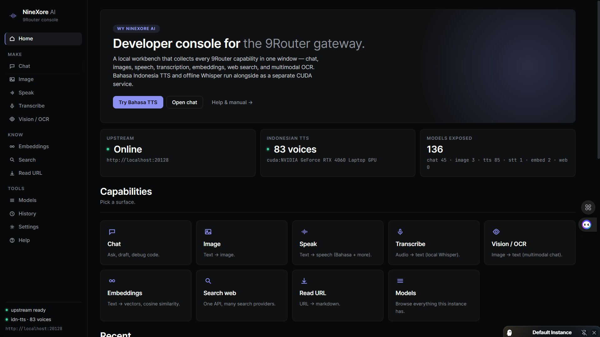
</p>

| | | |
|:--:|:--:|:--:|
| 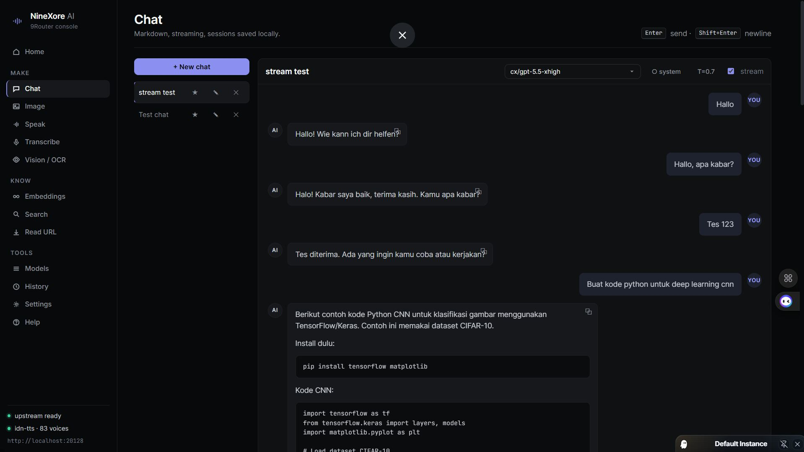         | 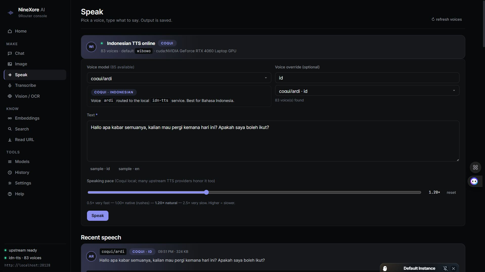          | 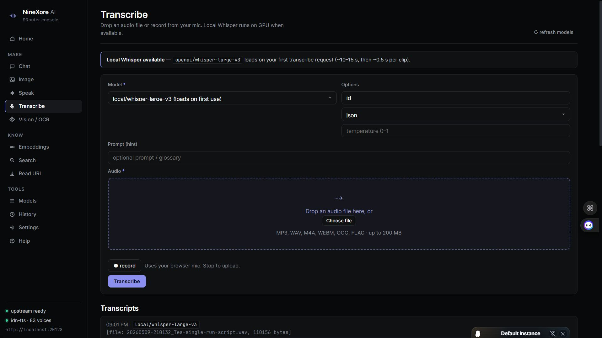         |
| **Chat** — streaming, sessions, markdown | **Speak** — Coqui (id) + Supertonic (31 langs) + speed slider | **Transcribe** — offline Whisper large-v3 |
| 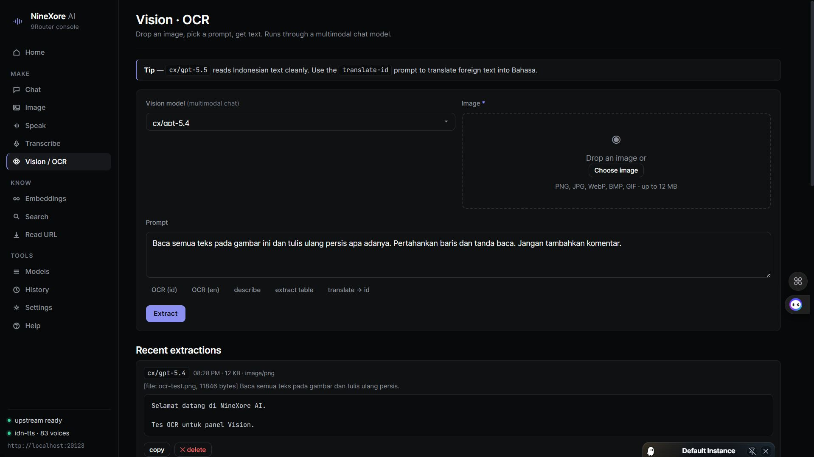 | 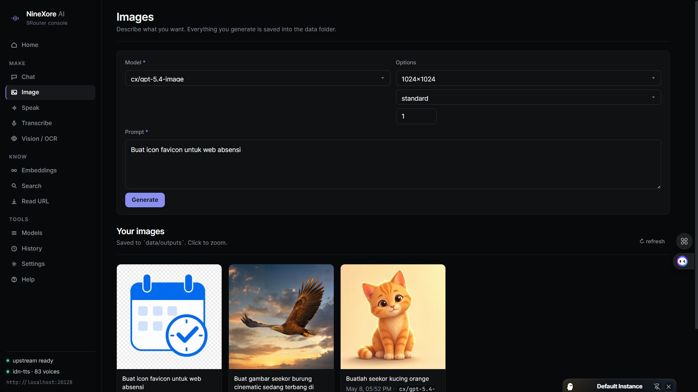            | 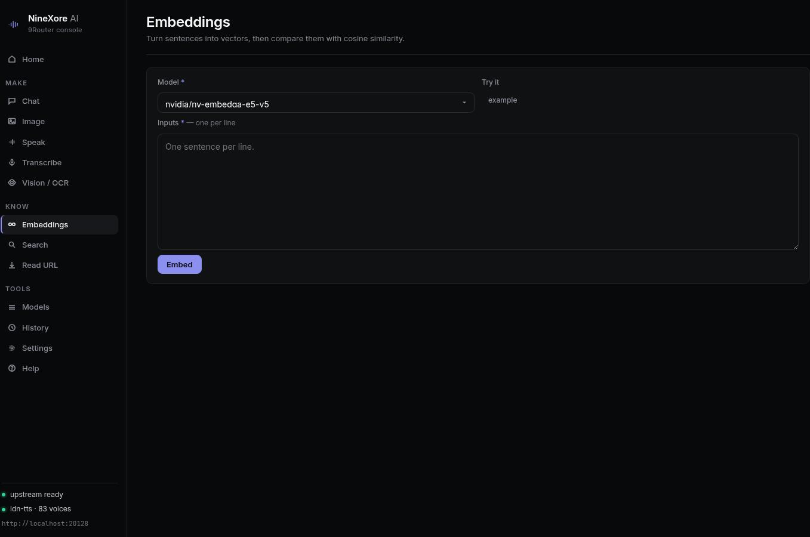 |
| **Vision / OCR** — multimodal extraction  | **Image** — text → image via Codex            | **Embeddings** — cosine similarity matrix |
| 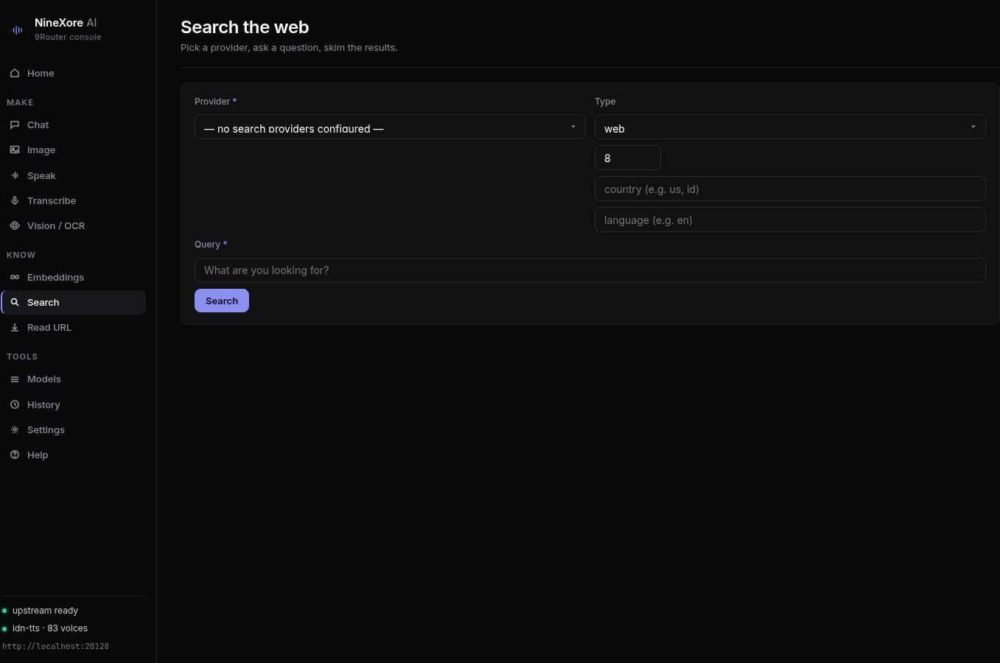       | 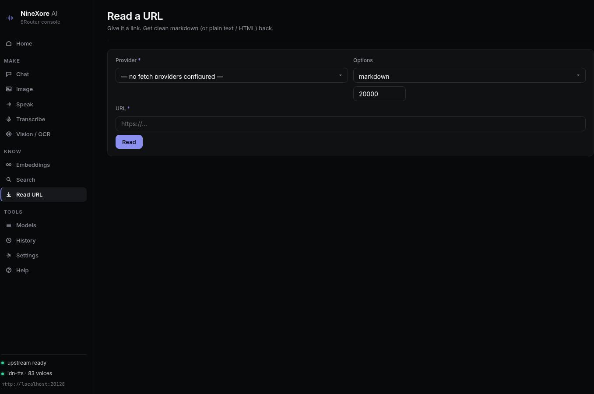         | 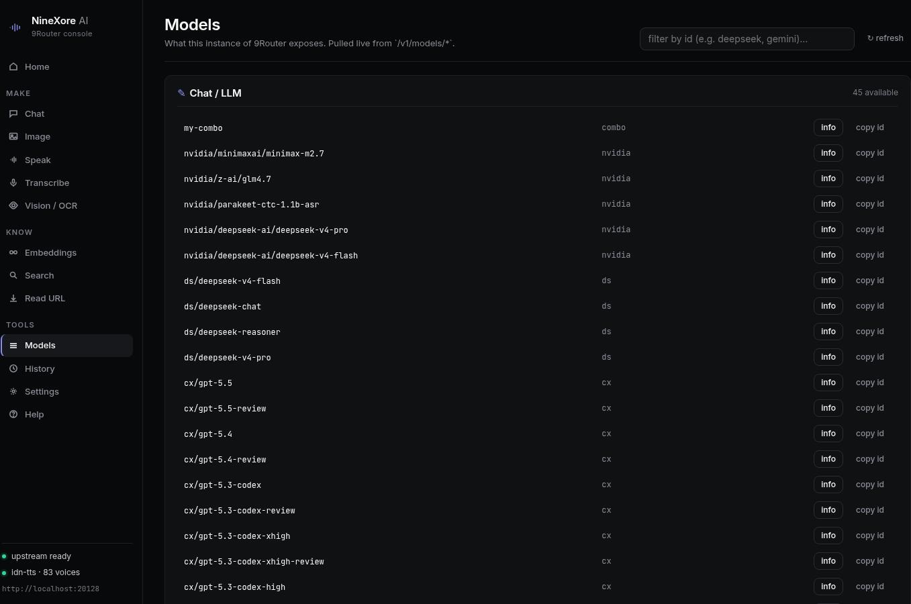 |
| **Search** — one API, many providers      | **Read URL** — URL → markdown / text / HTML     | **Models** — live catalogue from 9Router |
| 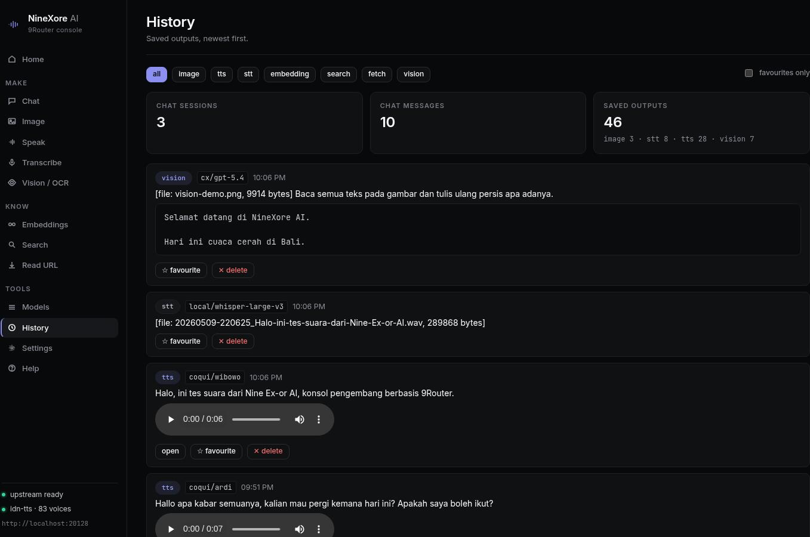     | 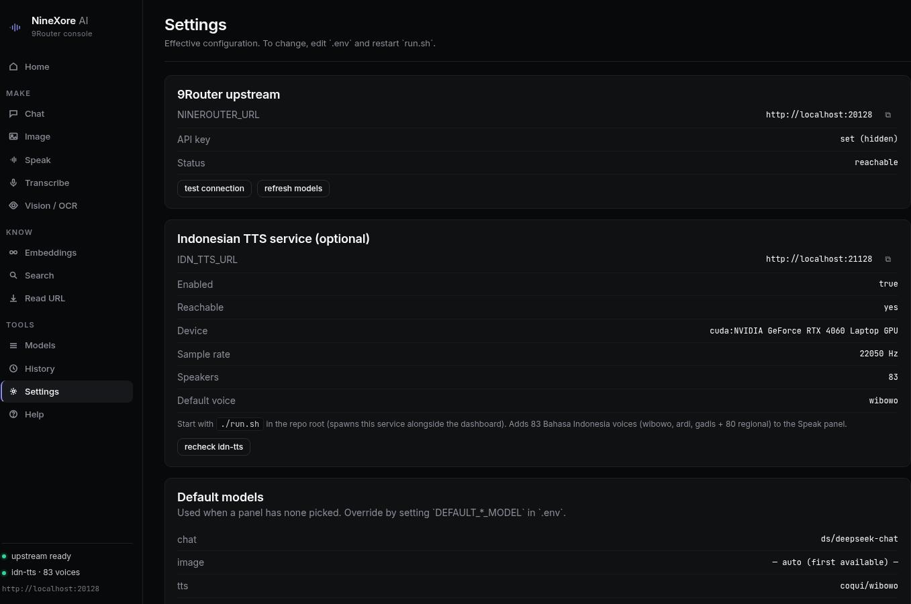      | 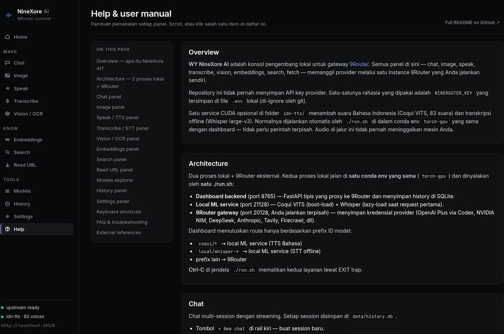 |
| **History** — everything, filterable      | **Settings** — effective config + status       | **Help** — in-app Indonesian-friendly manual |

### Audio samples

Real Coqui VITS output at speed `1.20×` (the dashboard default). Click a link to open the audio in a browser tab — the browser's built-in player streams the MP3 directly from GitHub.

- ▶ [`tts-wibowo.mp3`](docs/samples/tts-wibowo.mp3) — **Wibowo**, audiobook (default)
- ▶ [`tts-ardi.mp3`](docs/samples/tts-ardi.mp3)   — **Ardi**, Azure-trained
- ▶ [`tts-gadis.mp3`](docs/samples/tts-gadis.mp3)  — **Gadis**, Azure-trained, female
- ▶ [`tts-user-demo.mp3`](docs/samples/tts-user-demo.mp3) — a longer free-form demo

All clips were generated locally by the `idn-tts` service — **no audio left the machine to create them.**

### Vision / OCR sample

Input image that produced the “Selamat datang di NineXore AI” OCR you see in the Vision screenshot:

<p align="center">
  
</p>

---

## Architecture at a glance

Two local processes + your external 9Router instance. Both local processes
run in the **same** conda env (`torch-gpu`) and are spawned by the **same**
`./run.sh`:

```
                         Browser (http://127.0.0.1:8765)
                                    │
                ┌───────────────────┴───────────────────┐
                ▼                                       ▼
    ┌──────────────────────┐              ┌────────────────────────┐
    │  Dashboard backend   │ ◄── HTTP ──► │  Local ML service      │
    │  FastAPI · :8765     │              │  FastAPI + CUDA        │
    │                      │              │  :21128                │
    │                      │              │   - Coqui VITS (TTS)   │
    │                      │              │   - Whisper large-v3   │
    └──────────┬───────────┘              └────────────────────────┘
               │
               ▼                 single `torch-gpu` conda env,
    ┌──────────────────────┐    single ./run.sh starts both.
    │  9Router gateway     │
    │  :20128              │
    │  (external)          │
    └─────┬────────────────┘
          │
     ┌────┴────┬────────┬──────────┐
     ▼         ▼        ▼          ▼
   cx/*    nvidia/*   ds/*       kr/*
   Codex   NIM       DeepSeek    Claude-proxy
   (OpenAI  embed/     (chat)    (chat)
   Plus)    TTS
```

| Component | Port | Role |
|---|---|---|
| Dashboard backend | `8765` | proxies 9Router + persists history + serves UI |
| Local ML service  | `21128` | Coqui Indonesian TTS + local Whisper STT (lazy) |
| 9Router | `20128` | external OpenAI-compatible gateway (you run it) |

Both local processes live inside the **`torch-gpu`** conda env. The
dashboard does not embed any provider keys of its own — every external
call goes through 9Router. Local ML models run entirely on your machine.

---

## Providers used (configured inside 9Router)

This project is designed around three tiers of providers, all accessed through 9Router:

### 1. Codex — OpenAI Plus subscription (`cx/*`)
Codex is a proxy that exposes an OpenAI Plus account as an OpenAI-compatible API. We use it for:

| Model | Panel | Notes |
|---|---|---|
| `cx/gpt-5.4`, `cx/gpt-5.5` | **Chat**, **Vision / OCR** | multimodal, good with Indonesian text in images |
| `cx/gpt-5.2-codex`, `cx/gpt-5.3-codex-*` | **Chat** | code-focused variants |
| `cx/gpt-5.2-image`, `cx/gpt-5.3-image`, `cx/gpt-5.4-image` | **Image** | DALL-E equivalents (Plus/Pro subscription required) |

Authenticate once in 9Router with your ChatGPT Plus session. All further calls from this dashboard use that session transparently.

### 2. NVIDIA NIM (`nvidia/*`)
NVIDIA's hosted inference for embeddings and TTS.

| Model | Panel | Notes |
|---|---|---|
| `nvidia/nv-embedqa-e5-v5` | **Embeddings** | 1024-dim, fast, good for RAG |
| `nvidia/fastpitch`, `nvidia/tacotron2` | **Speak (TTS)** | English-only; use Coqui for Bahasa |

Get an API key from [build.nvidia.com](https://build.nvidia.com/) and add it to your 9Router instance (`Dashboard → Providers → NVIDIA NIM`).

### 3. Local models (no external API)
Runs in your own `torch-gpu` env via the `idn-tts/` service in this repo.

| Model | Panel | Notes |
|---|---|---|
| **Coqui VITS** (Wikidepia/indonesian-tts v1.2) | **Speak (TTS)** | 83 Bahasa voices (`coqui/wibowo`, `coqui/ardi`, `coqui/gadis` + 80 regional) |
| **Supertonic 3** (Supertone/supertonic-3, ONNX) | **Speak (TTS)** | 10 stock voices (`M1`–`M5`, `F1`–`F5`) covering **31 languages** including `id`, `en`, `ja`, `ko`, `vi`, `fr`, `de`, `es`, `ar`. Audio stays on the laptop. ~260 MB download on first synth. |
| **openai/whisper-large-v3** (HuggingFace local) | **Transcribe (STT)** | `local/whisper-large-v3`, loaded lazily on first request |

Your audio never leaves the machine.

### Optional 3rd-party providers
9Router also supports Tavily / Exa / Brave for search, Firecrawl / Jina Reader for URL fetch, ElevenLabs / Edge-TTS / Deepgram for more voice options, etc. All opt-in — add the key in 9Router and the dashboard will surface them automatically.

---

## Quick start

Prerequisites:
- Linux or macOS with a recent Python (3.10+)
- [Miniconda / Anaconda](https://docs.conda.io/en/latest/miniconda.html)
- A running [9Router](https://github.com/decolua/9router) instance on `http://localhost:20128`
- NVIDIA GPU with CUDA 12.x (for Bahasa TTS + Whisper; CPU works too, just slower)

### 1. Clone

```bash
git clone https://github.com/Wayan123/WY-NineXore-AI.git
cd WY-NineXore-AI
```

### 2. Single conda env (`torch-gpu`)

One env hosts both the dashboard and the local ML service:

```bash
# create if you don't have one; PyTorch match your CUDA build
conda create -n torch-gpu python=3.10 -y
conda activate torch-gpu
pip install torch torchaudio --index-url https://download.pytorch.org/whl/cu128  # adjust cuXXX
bash scripts/install-deps.sh   # wraps requirements.txt + supertonic --no-deps
```

Using a different env name? `CONDA_ENV=my-env ./run.sh`.

### 3. Configure

```bash
cp .env.example .env
nano .env
```

Three lines usually need attention:

```dotenv
NINEROUTER_URL=http://localhost:20128           # where your 9Router listens
NINEROUTER_KEY=sk-xxxxxxxxxxxxxxxxxxxxxxxxxxxx  # paste from 9Router → Dashboard → Keys
IDN_TTS_ENABLED=true                            # set to false to skip local ML entirely
```

Everything else has sensible defaults (see [`.env.example`](./.env.example)).

### 4. Run — one command

```bash
./run.sh
```

That single script:
- activates `torch-gpu` (or your `CONDA_ENV` override)
- installs missing Python deps on first run
- downloads ~330 MB of Coqui Indonesian TTS weights on first run (idempotent)
- starts the local ML service on `:21128` (waits for `/health` up to 30 s)
- starts the dashboard on `:8765`
- **Ctrl-C stops everything cleanly** — both uvicorn processes go down via an EXIT trap

Open http://127.0.0.1:8765. The sidebar footer should show `upstream ready` and `idn-tts · 83 voices` once the local service finishes loading.

> Want to run only the ML service (e.g. on a separate host)?
> `cd idn-tts && ./run.sh`. The dashboard will reach it via `IDN_TTS_URL`.

---

## Tutorial — panel by panel

### Chat (`#/chat`)
Multi-session chat with streaming output. Each session lives in SQLite under `data/history.db`.

1. Click **+ New chat** in the left rail.
2. Pick a model from the dropdown (defaults to `ds/deepseek-chat`).
3. Type → Enter to send, Shift+Enter for a newline.
4. The chat header has three buttons:
   - **system** — a per-session instruction the model sees before every reply (opens a modal)
   - **T=0.7** — generation knobs (temperature + max tokens)
   - **stream** — toggle SSE streaming

Sessions can be pinned (★), renamed (✎), or deleted (✕). Pinned sessions sort first.

**Good defaults**: `kr/claude-haiku-4.5` for quick drafts, `cx/gpt-5.4` for vision + reasoning, `ds/deepseek-chat` for long context.

### Image (`#/image`)
Text → image via `cx/*-image` Codex models. Requires an OpenAI Plus subscription upstream.

1. Pick a model — typically `cx/gpt-5.4-image`.
2. Write a prompt in English or Indonesian.
3. Optional: size (default `1024x1024`), quality, n.
4. **Generate**. Images save to `data/outputs/*.png` and show in the gallery below.

Click a thumbnail to open at full size. Favourite (★) or delete (✕) per item.

### Speak — TTS (`#/tts`)
Two kinds of voices:

- **Coqui (recommended for Indonesian)**: `coqui/wibowo`, `coqui/ardi`, `coqui/gadis` + 80 regional speakers (Javanese, Sundanese). Runs locally in the `idn-tts` service.
- **Upstream**: NVIDIA NIM (`nvidia/fastpitch`, `nvidia/tacotron2`), or whatever else your 9Router instance has (Edge-TTS, ElevenLabs, OpenAI, …).

1. The model dropdown groups "Coqui · Indonesian (recommended)" first.
2. Type text (placeholder switches to Bahasa when a coqui voice is selected).
3. **Speaking pace** — slider `0.5×` (very fast) to `2.5×` (very slow). `1.20×` is the natural-sounding default. Reset button returns to `1.20×`.
4. **Speak** → WAV/MP3 saved to `data/outputs/`.

Click **sample · id** or **sample · en** to load an example phrase.

### Transcribe — STT (`#/stt`)
Default model: `local/whisper-large-v3` (offline, GPU-accelerated, Indonesian-aware).

1. Drag an audio file onto the dropzone, or click **record** to capture from your mic (MediaRecorder API).
2. Optional: language hint (default `id` for Whisper), prompt, response format.
3. **Transcribe**.

First Whisper request loads the 2.9 GB model (~10–15 s). Subsequent requests are <1 s on a mid-range GPU.

Upstream STT options (OpenAI Whisper API, Groq, Deepgram, …) show up when configured in 9Router.

### Vision / OCR (`#/vision`) — **image → text**
Uses multimodal chat models to read text from images.

1. Drop an image (PNG, JPG, WebP, BMP, GIF) — up to 12 MB.
2. Pick a model. Known good: `cx/gpt-5.4`, `cx/gpt-5.5`, or Claude if provisioned.
3. Pick a prompt chip:
   - **OCR (id)** — Indonesian extraction, verbatim
   - **OCR (en)** — English extraction
   - **describe** — natural-language summary
   - **extract table** — returns Markdown pipe table
   - **translate → id** — reads foreign text and returns it translated to Bahasa

The result renders as markdown below the form; full output is copyable and stored in history.

### Embeddings (`#/embed`)
Turn sentences into vectors and compare them with cosine similarity.

1. One sentence per line in the textarea (`example` button fills a demo set).
2. Model defaults to `nvidia/nv-embedqa-e5-v5` (1024-dim).
3. **Embed** returns: summary pills, a colour-graded similarity matrix (lavender = closer), and the first 8 dimensions of each vector.
4. **copy vectors** copies the full matrix to clipboard as JSON.

### Search (`#/search`)
Web search through any 9Router-configured provider (Tavily, Exa, Brave, Serper, …).

### Read URL (`#/fetch`)
URL → markdown/text/HTML via Firecrawl, Jina Reader, Tavily Extract, or Exa Contents. HTML is rendered inside a sandboxed iframe so remote pages cannot touch your origin.

### Models (`#/models`)
Live browser over every model your 9Router instance exposes, grouped by kind. Filter by ID (e.g. `deepseek`, `gemini`, `coqui`). Click **info** on any model to see its JSON metadata.

### History (`#/history`)
Every output you've generated, filterable by kind (image / tts / stt / embedding / search / fetch / vision). Star favourites, delete, see rolling stats.

### Settings (`#/settings`)
Read-only view of effective config, live upstream probe, Indonesian TTS status panel with speakers count and Whisper device/loaded state.

---

## Keyboard shortcuts

Available anywhere outside a text field (vim-style `g` prefix):

| Keys | Panel |
|---|---|
| `g h` | Home |
| `g c` | Chat |
| `g i` | Image |
| `g t` | Speak (TTS) |
| `g r` | Transcribe (STT) |
| `g v` | Vision / OCR |
| `g e` | Embeddings |
| `g s` | Search |
| `g f` | Read URL |
| `g m` | Models |
| `g y` | History |
| `g ,` | Settings |

Inside chat: `Enter` sends, `Shift+Enter` is newline, `Esc` closes modals.

---

## Configuration reference (`.env`)

```dotenv
# ----- 9Router gateway -----
NINEROUTER_URL=http://localhost:20128      # your 9Router URL
NINEROUTER_KEY=                            # paste from 9Router → Keys (empty if requireApiKey=false)

# ----- Indonesian TTS + Whisper STT service (optional, see idn-tts/) -----
IDN_TTS_URL=http://localhost:21128
IDN_TTS_ENABLED=true

# ----- Dashboard server -----
APP_HOST=127.0.0.1                         # 0.0.0.0 to expose on LAN (read SECURITY.md first)
APP_PORT=8765
DATA_DIR=./data                            # history DB + generated images/audio
REQUEST_TIMEOUT=180                        # seconds; bump for slow providers

# ----- Default models (blank = auto-pick first available) -----
DEFAULT_CHAT_MODEL=ds/deepseek-chat
DEFAULT_IMAGE_MODEL=
DEFAULT_TTS_MODEL=coqui/wibowo
DEFAULT_STT_MODEL=local/whisper-large-v3
DEFAULT_EMBEDDING_MODEL=nvidia/nv-embedqa-e5-v5
DEFAULT_SEARCH_MODEL=
DEFAULT_FETCH_MODEL=
```

See [`.env.example`](./.env.example) for the full commented list.

---

## Security

- **Never commit `.env`** — it is already in `.gitignore`. The only key this project uses is your `NINEROUTER_KEY`.
- The dashboard does not store provider keys. All external calls go through 9Router, which holds them.
- Binding `APP_HOST=0.0.0.0` exposes the dashboard to anyone on your network *without* authentication. Do not do this without a reverse proxy with TLS + auth.
- Local Whisper keeps audio on your machine; nothing is uploaded.
- See [`docs/SECURITY.md`](./docs/SECURITY.md) for the full threat model.

---

## Development

### Running tests

```bash
conda activate torch-gpu
pytest tests/ -v          # 26 tests, all use an in-memory fake of 9Router
```

### Project layout

```
WY-NineXore-AI/
├── backend/                       # FastAPI app (dashboard)
│   ├── main.py
│   ├── config.py                  # pydantic-settings, reads .env
│   ├── client.py                  # async httpx wrapper around 9Router
│   ├── idn_tts.py                 # client for the optional local ML service
│   ├── routes/                    # one file per capability (+ vision.py, stt.py)
│   └── storage/db.py              # SQLite history store
├── frontend/
│   ├── index.html
│   ├── favicon.svg
│   └── assets/
│       ├── styles.css             # dark canvas, single lavender accent
│       ├── app.js                 # hash router + status poller
│       ├── store.js               # cached models + settings
│       ├── api.js                 # fetch helpers + SSE
│       ├── ui.js                  # toasts, modal, DOM helpers
│       ├── md.js                  # tiny markdown renderer
│       └── components/            # home / chat / image / tts / stt / vision / …
├── idn-tts/                       # Local CUDA service (spawned by root run.sh)
│   ├── service.py                 # Coqui VITS + Whisper in one FastAPI app
│   ├── run.sh
│   ├── download.sh                # fetches Wikidepia/indonesian-tts v1.2
│   ├── requirements.txt
│   ├── models/                    # .gitignored — populated by download.sh
│   └── README.md
├── data/                          # .gitignored runtime dir
│   ├── history.db                 # chat sessions + generated outputs index
│   └── outputs/                   # saved images / wav / mp3
├── docs/
│   ├── ARCHITECTURE.md
│   ├── SETUP.md
│   ├── SECURITY.md
│   └── API.md                     # REST reference
├── tests/                         # pytest smoke tests (fake upstream)
├── DESIGN.md                      # the dark-canvas design system
├── .env.example                   # starter config (no real keys)
├── .gitignore
├── run.sh                         # starts both services in one conda env
├── requirements.txt
├── LICENSE
└── README.md
```

---

## FAQ

**Do I need all three services?**
No. Just the dashboard + a 9Router instance gets you chat, images, web search, URL fetch, embeddings, and any upstream TTS/STT 9Router has configured. The local `idn-tts` service adds offline Bahasa TTS and Whisper — skip it if you don't need those.

**I don't see `coqui/*` voices in the TTS panel.**
The `idn-tts` service isn't reachable. Check:
1. `curl http://127.0.0.1:21128/health` returns JSON (the root `./run.sh` should have started it; if not, check `/tmp/wy-nine-idn-tts.log`).
2. `IDN_TTS_ENABLED=true` in `.env`.
3. Press **↻ refresh voices** at the top of the TTS panel.

**Whisper is slow on the first transcribe.**
Expected. The 2.9 GB `openai/whisper-large-v3` model loads lazily into GPU memory on first call (~10–15 s). Subsequent calls are <1 s.

**Image generation returns "Codex did not return an image. Plus/Pro required."**
9Router's Codex provider needs an active ChatGPT Plus or Pro subscription. Other image providers (Gemini nano-banana, FLUX, Stability, Recraft) work without Plus if you add the key.

**The dashboard killed my terminal when I closed it.**
Use `./run.sh` which handles process lifetime cleanly, or `nohup uvicorn backend.main:app ... &` and `disown` if you need to detach manually.

---

## Skills (for AI coding agents)

This project pairs with a curated AI-agent skill pack from
[my-grand-project-skills](https://github.com/Wayan123/my-grand-project-skills) —
planning, debugging, secret scanning, release management, design discipline,
and more. Skills live locally at `.agents/skills/` (gitignored). One command
installs or upgrades them with smart-sync:

```bash
bash scripts/install-skills.sh           # smart-sync
bash scripts/install-skills.sh --dry-run # preview, no writes
```

See [`SKILLS.md`](./SKILLS.md) for the full list of installed skills and the
reasoning behind each pick.

---

## Credits

- [9Router](https://github.com/decolua/9router) by decolua — the gateway this project sits on top of.
- [Wikidepia/indonesian-tts](https://github.com/Wikidepia/indonesian-tts) — Coqui VITS fine-tune for Bahasa Indonesia.
- [g2p-id](https://github.com/Wikidepia/g2p-id) — grapheme → phoneme conversion for Bahasa.
- [Supertonic](https://github.com/supertone-inc/supertonic) by Supertone — on-device 31-language TTS (ONNX).
- [OpenAI Whisper](https://huggingface.co/openai/whisper-large-v3) — STT model.
- Design language adapted from [VoltAgent/awesome-design-md](https://github.com/VoltAgent/awesome-design-md) (Linear + ElevenLabs patterns). See [`DESIGN.md`](./DESIGN.md).

---

## License

MIT. See [`LICENSE`](./LICENSE).

**Do not use the Wikidepia/indonesian-tts model weights for commercial purposes** — per the upstream model licence. The MIT licence covers this project's source code only.
